# Entity Relationship Diagram (ERD) - Sistem Informasi Sekolah

Berikut ini adalah ERD (Entity Relationship Diagram) yang memetakan relasi antar tabel-tabel utama yang ada pada aplikasi, dibuat berdasarkan migrasi dan model yang telah dirancang.

```mermaid
erDiagram
    USERS {
        bigint id PK
        string username
        string email
        string role
        string password
    }

    GURU {
        bigint id PK
        bigint user_id FK
        string nip
        string nuptk
        string nama_lengkap
        string jabatan
        boolean is_active
    }

    SISWA {
        bigint id PK
        bigint user_id FK
        string nisn
        string nis
        string nama_lengkap
        string tahun_masuk
        boolean is_active
    }

    KELAS {
        bigint id PK
        string nama_kelas
        tinyint tingkat
        string kode_kelas
        string tahun_pelajaran
    }

    PELAJARAN {
        bigint id PK
        string kode_pelajaran
        string nama_pelajaran
        string kategori
    }

    KELAS_SISWA {
        bigint id PK
        bigint kelas_id FK
        bigint siswa_id FK
        string nomor_absen
        string status
    }

    KELAS_GURU {
        bigint id PK
        bigint kelas_id FK
        bigint guru_id FK
        bigint pelajaran_id FK
        string jabatan
    }

    JADWAL_PELAJARAN {
        bigint id PK
        bigint kelas_id FK
        bigint pelajaran_id FK
        bigint guru_id FK
        string hari
        tinyint jam_ke
        time jam_mulai
        time jam_selesai
    }

    MATERI_PEMBELAJARAN {
        bigint id PK
        bigint kelas_id FK
        bigint pelajaran_id FK
        bigint guru_id FK
        string judul
        string file_materi
        string tipe
    }

    JADWAL_TUGAS {
        bigint id PK
        bigint kelas_id FK
        bigint pelajaran_id FK
        bigint guru_id FK
        string judul_tugas
        datetime tanggal_mulai
        datetime tenggat_waktu
    }

    TUGAS_SISWAS {
        bigint id PK
        bigint jadwal_tugas_id FK
        bigint siswa_id FK
        string status
        tinyint nilai
    }

    ABSENSI {
        bigint id PK
        bigint kelas_id FK
        bigint siswa_id FK
        date tanggal
        tinyint jam_ke
        string status
    }

    RAPOR_PENILAIAN {
        bigint id PK
        bigint siswa_id FK
        string tahun_pelajaran
        string semester
        float nilai_total
    }

    RAPOR_PENILAIAN_ITEMS {
        bigint id PK
        bigint rapor_id FK
        bigint guru_id FK
        bigint pelajaran_id FK
        bigint materi_id FK
        string jenis
        float nilai
    }

    BUKUS {
        bigint id PK
        string judul
        string pengarang
        integer stok
        integer tahun_terbit
    }

    PEMINJAMAN_BUKUS {
        bigint id PK
        bigint siswa_id FK
        bigint buku_id FK
        date tanggal_pinjam
        date tanggal_kembali
        string status
    }

    %% Relationships
    USERS ||--o| GURU : "has one"
    USERS ||--o| SISWA : "has one"
    
    KELAS ||--o{ KELAS_SISWA : "has many"
    SISWA ||--o{ KELAS_SISWA : "has many"
    
    KELAS ||--o{ KELAS_GURU : "has many"
    GURU ||--o{ KELAS_GURU : "has many"
    PELAJARAN ||--o{ KELAS_GURU : "has many"

    KELAS ||--o{ JADWAL_PELAJARAN : "has many"
    PELAJARAN ||--o{ JADWAL_PELAJARAN : "has many"
    GURU ||--o{ JADWAL_PELAJARAN : "has many"

    KELAS ||--o{ MATERI_PEMBELAJARAN : "has many"
    PELAJARAN ||--o{ MATERI_PEMBELAJARAN : "has many"
    GURU ||--o{ MATERI_PEMBELAJARAN : "has many"

    KELAS ||--o{ JADWAL_TUGAS : "has many"
    PELAJARAN ||--o{ JADWAL_TUGAS : "has many"
    GURU ||--o{ JADWAL_TUGAS : "has many"

    JADWAL_TUGAS ||--o{ TUGAS_SISWAS : "has many"
    SISWA ||--o{ TUGAS_SISWAS : "has many"

    KELAS ||--o{ ABSENSI : "has many"
    SISWA ||--o{ ABSENSI : "has many"

    SISWA ||--o{ RAPOR_PENILAIAN : "has many"
    RAPOR_PENILAIAN ||--o{ RAPOR_PENILAIAN_ITEMS : "has many"
    GURU ||--o{ RAPOR_PENILAIAN_ITEMS : "has many"
    PELAJARAN ||--o{ RAPOR_PENILAIAN_ITEMS : "has many"
    MATERI_PEMBELAJARAN ||--o{ RAPOR_PENILAIAN_ITEMS : "has many"

    SISWA ||--o{ PEMINJAMAN_BUKUS : "has many"
    BUKUS ||--o{ PEMINJAMAN_BUKUS : "has many"

```

